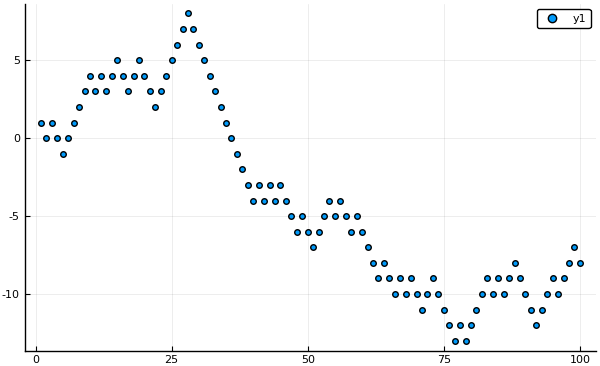

# Tridiagonalni sistemi

## Slučajni sprehod

Poglejmo si primer [slučajnega sprehoda](https://en.wikipedia.org/wiki/Random_walk)
v eni dimenziji. Slučajni sprehod je vrsta [stohastičnega procesa](https://en.wikipedia.org/wiki/Stochastic_process), ki ga lahko
opišemo z [Markovsko verigo](https://en.wikipedia.org/wiki/Markov_chain) z
množico stanj enako celim številom. Če se trenutno nahajamo v stanju $n$,
se lahko v naslednjem koraku z verjetnostjo $p$ premaknemo v stanje $n-1$ ali z verjetnostjo
$q=1-p$ pa v stanje $n+1$.

```julia
# Primer prvih 100 korakov slučajnega sprehoda p=q=1/2
using Plots
scatter(cumsum(2*round.(rand(100)).-1))
savefig("sprehod.png")
```



### Naloga

Izračunaj povprečno število 
korakov, ki jih potrebujemo, da se od izhodišča oddaljimo za $k$ korakov.

### Markovske verige

!!! note "Prehodna matrika Markovske verige"

    Markovsko verigo lahko opišemo z zaporedjem slučajnih spremenljivk $X_k$, $k=1,\ldots$,
    ki opisujejo trenutno stanje Markovske verige z Markovsko lastnostjo
    ```math
    P(X_{n+1}=x_{n+1}|X_1=x_1, X_2=x_2, \ldots, X_{n}=x_n) = P(X_{n+1}=x_{n+1}|X_{n}=x_n),
    ```
    ki pomeni, da je verjetnost za prehod v naslednje stanje odvisna le od prejšnjega stanja
     in ne od starejše zgodovine stanj.
    Matriko $P$, katere elementi so prehodne verjetnosti prehodov med stanji Markovske verige
    ```math
    p_{ij} = P(X_n = j| X_{n-1} = i)
    ```
    imenujemo [prehodna matrika](https://sl.wikipedia.org/wiki/Stohasti%C4%8Dna_matrika)
    Markovske verige. Za prehodno matriko velja, da vsi elementi ležijo na $[0,1]$
    in je vsota elementov po vrsticah enaka 1
    ```math
    P\mathbf{1} = \mathbf{1}
    ```

### Absorpcijska stanja

*Absorpcijsko stanje* je stanje, iz katerega se ne moremo več premakniti, medtem ko je *prehodno stajne*
stanje, ki ga obiščemo le končno mnogo krat.
Markovske verige z absorpcijskimi takimi stanji imenujemo
[absobirajoča Markovska veriga](https://en.wikipedia.org/wiki/Absorbing_Markov_chain).
Vrstica v prehodni matriki, ki ustreza absorpcijskemu stanju ima le diagonalni
element enak 1, vsi ostali so nič.

!!! note "Fundamentalna matrika"

    Če ima Markovska veriga absorpcijska stanja, lahko prehodno matriko
    zapišemo v naslednji bločni obliki
    ```math
    P  = \begin{bmatrix}Q & T\\ 0 & I\end{bmatrix},
    ```
    kjer vrstice $[Q, T]$ ustrezajo prehodnim stanjem, med tem ko vrstice
    $[0, I]$ ustrezajo absorpcijskim stanjem. Matrika $Q$ opiše prehodne verjetnosti
    za sprehod med prehodnimi stanji, matrika $Q^k$ prehodne
    verjetnosti po $k$ korakih, če se sprehajamo le po prehodnih stanjih.
    ```math
    N = \sum_{k=0}^\infty Q^k = (I-Q)^{-1}
    ```
    imenujemo *fundamentalna matrika* absorbirajoče markovske verige. Elementi
    $n_{ij}$ predstavlja pričakovano število obiskov stanja $j$, če začnemo
    v stanju $i$.

Pričakovano število korakov, da dosežemo absorpcijsko stanje iz začetnega stanja $i$
je $i$-ta komponenta produkta fundamentalne matrike $N$ z vektorjem samih enic

```math
\mathbf{k} = N\mathbf{1} = (I-Q)^{-1}\mathbf{1}.
```

Če želimo poiskati pričakovano število korakov, moramo rešiti sistem linearnih enačb

```math
(I-Q)\mathbf{k} = \mathbf{1}.
```

### Prehodna in fundamentalna matrika slučajnega sprehoda
Če nas zanima le kdaj bo sprehod za $k$ oddaljen od izhodišča, lahko začnemo v $0$ in
stanji $k$ in $-k$ proglasimo za absorpcijska stanja. Prehodna matrika, ki jo dobimo je
tridiagonalna z 0 na diagonali. Matrika $I-Q$ je prav tako tridiagonalna z $1$ na diagonali
in z negativnimi verjetnostmi $-p$ in $-q = p-1$ na obdiagonalnih elementih:

```math
I-Q = \begin{pmatrix}
1 & -q & 0 & \ldots & 0\\
-p & 1 & -q & \ldots & 0\\
\vdots & \ddots & \ddots & \ddots & \vdots\\
0 & \ldots & -p & 1 & -q\\
0 & \ldots & 0 & -p & 1
\end{pmatrix}
```
## Prilagojen podatkovni tip

Naj bo $A\in\mathbb{R}^{n\times n}$ tri-diagonalna, diagonalno
dominantna matrika. Primer tridiagonalne $4\times 4$ matrike

```math
A=\left( \begin{array}{rrrr} 3 & 1 & 0 & 0\\ 2 & 4 & -1 & 0\\ 0 & 1 & 3 &
-1\\ 0 & 0 & -1 & 8 \end{array}\right).
```

Definirajte podatkovni tip `Tridiagonalna`, ki hrani le neničelne elemente
tridiagonalne matrike. Za podatkovni tip `Tridiagonalna` definirajte metode za
naslednje funkcije:

- indeksiranje: `Base.getindex`,`Base.setindex!`,`Base.firstindex` in `Base.lastindex`
- množenje z desne `Base.*` z vektorjem
- „deljenje“ z leve `Base.\`

Časovna zahtevnost omenjenih funkcij naj bo linearna. Več informacij o
[tipih](https://docs.julialang.org/en/v1/manual/types/) in
[vmesnikih](https://docs.julialang.org/en/v1/manual/interfaces/).


## Poissonova enačba na krogu

Drug primer, ko dobimo tridiagonalni sistem lineranih enačb, če
iščemo rešitev za robni problem na krogu $x^2+y^2\le 1$ za
[Poissonovo enačbo](https://sl.wikipedia.org/wiki/Poissonova_ena%C4%8Dba)

```math
\triangle u(x,y) = f(r)
```

z robnim pogojem $u(x,y)=0$ za $x^2 + y^2 = 1$. Pri tem je $f(r) = f(\sqrt{x^2+y^2})$
podana funkcija, ki je odvisna le od razdalje do izhodišča.

[Laplaceov operator](https://en.wikipedia.org/wiki/Laplace_operator) zapišemo v
polarnih koordinatah in enačbo diskretiziramo z metodo
[končnih diferenc](https://en.wikipedia.org/wiki/Finite_difference).

