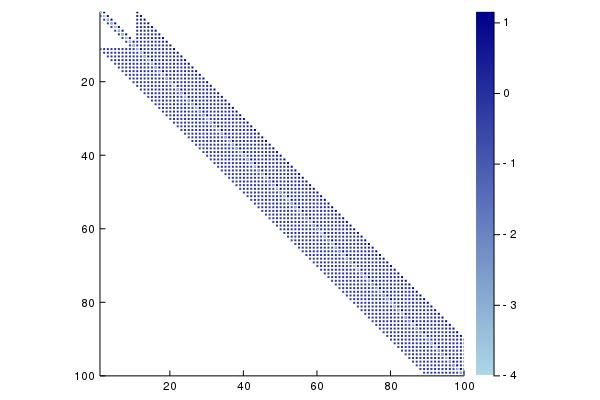

# Minimalne ploskve (Laplaceova enačba)

## Naloga

Žično zanko s pravokotnim tlorisom potopimo v milnico, tako da se nanjo
napne milna opna.

Radi bi poiskali obliko milne opne, razpete na žični zanki. Malo
brskanja po fizikalnih knjigah in internetu hitro razkrije, da ploskve,
ki tako nastanejo, sodijo med [minimalne ploskve](http://en.wikipedia.org/wiki/Minimal_surface), ki so burile domišljijo
mnogim matematikom in nematematikom. Minimalne
ploskve so navdihovale tudi umetnike npr. znanega arhitekta [Otto Frei](https://en.wikipedia.org/wiki/Frei_Otto), ki je sodeloval pri zasnovi Muenchenskega olimpijskega
stadiona, kjer ima streha obliko minimalne ploskve.


Slika [wikipedia](https://de.wikipedia.org/wiki/Olympiastadion_M%C3%BCnchen#/media/File:Olympic_Stadium_Munich_Dachbegehung.JPG)

## Matematično ozadje

Ploskev lahko predstavimo s funkcijo dveh spremenljivk $u(x,y)$, ki
predstavlja višino ploskve nad točko $(x,y)$. Naša naloga bo poiskati
funkcijo $u(x,y)$ na tlorisu žične mreže.

Funkcija $u(x,y)$, ki opisuje milno opno, zadošča matematična enačbi,
znani pod imenom [Poissonova enačba](https://sl.wikipedia.org/wiki/Poissonova_ena%C4%8Dba)

```math
\Delta u(x,y)=\rho(x,y).\label{eq:Poisson}
```

Funkcija $\rho(x,y)$ je sorazmerna tlačni razliki med zunanjo in notranjo
površino milne opne. Tlačna razlika je lahko posledica višjega tlaka v
notranjosti milnega mehurčka ali pa teže, v primeru opne, napete na
žični zanki. V primeru minimalnih ploskev pa tlačno razliko kar zanemarimo
in dobimo [Laplaceovo enačbo](https://en.wikipedia.org/wiki/Laplace%27s_equation)

$$\Delta u(x,y) = 0\label{Laplace}.$$

Če predpostavimo, da je oblika na robu območja določena z obliko zanke, rešujemo [robni problem](https://en.wikipedia.org/wiki/Boundary_value_problem) za Laplaceovo enačbo. Predpostavimo, da je območje pravokotnik $[a, b]\times[c, d]$. Poleg Laplacove enačbe, veljajo za vrednosti funkcije $u(x, y)$ tudi *robni pogoji*:

```math
\begin{array}{ll}
u(x, c) = f_s(x) & u(x, d) = f_z(x)\\
u(a, y) = f_l(y) & u(b, y) = f_d(y),\\
\end{array}
```

kjer so $f_s, f_z, f_l$ in $f_d$ dane funkcije. Rešitev robnega problema je tako odvisna od območja, kot tudi od robnih pogojev.

Za numerično rešitev Laplaceove enačbe za minimalno ploskev dobimo navdih pri arhitektu Frei Otto, ki je minimalne ploskve [raziskoval tudi z elastičnimi tkaninami](https://youtu.be/-IW7o25NmeA).

## Diskretizacija in linearni sistem enačb

Problema se bomo lotili numerično, zato bomo vrednosti $u(x,y)$ poiskali
le v končno mnogo točkah: problem bomo *diskretizirali.* Za
diskretizacijo je najpreprosteje uporabiti enakomerno razporejeno
pravokotno mrežo točk. Točke na mreži imenujemo *vozlišča*. Zaradi
enostavnosti bomo obravnavali le mreže z enakim razmikom v obeh
koordinatnih smereh. Omejimo se le na pravokotna območja v ravnini
$[a, b]\times[c, d]$. Interval $[a, b]$ razdelimo na $n+1$ delov, interval
$[c, d]$ pa na $m+1$ delov in dobimo zaporedje koordinat

```math
\begin{array}{lcl}
a=x_0, x_1,&\ldots&x_{n+1}=b\\
c=y_0, y_1,&\ldots&y_{m+1}=d,\\
\end{array}
```

ki definirajo pravokotno mrežo točk $(x_i, y_j)$.
Namesto funkcije $u: [a,b]\times[c,d]\to \mathbb{R}$ tako iščemo le vrednosti

```math
u_{ij} = u(x_i, y_j),\quad i=1,\ldots n, j=1,\ldots m
```


Iščemo torej enačbe, ki jim zadoščajo elementi matrike $u_{ij}$.
Laplaceovo enačbo lahko diskretiziramo z [končnimi diferencami](https://en.wikipedia.org/wiki/Finite_difference), lahko pa izpeljemo enačbe, če si ploskev predstavljamo kot elastično tkanino, ki je fina kvadratna mreža iz elastičnih nitk. Vsako vozlišče v mreži je povezano s 4 sosednjimi vozlišči. Vozlišče bo v ravnovesju, ko bo vsota vseh sil nanj enaka 0. Predpostavimo, da so vozlišča povezana z idealnimi vzmetmi in je sila sorazmerna z razliko. Če zapišemo enačbo za komponente sile v smeri $z$, dobimo za točko $(x_i, y_j, u_{ij})$ enačbo

```math
u_{i-1,j}+u_{i,j-1} - 4u_{ij} + u_{i+1,j}+u_{i,j+1} = 0.
```

Za $u_{ij}$ imamo tako sistem linearnih enačb. Ker pa so vrednotsi na robu določene z robnimi pogoji, moramo elemente $u_{0j}$, $u_{n+1,j}$, $u_{i0}$ in $u_{im+1}$ prestaviti na desno stran in jih upoštevati kot konstante.

## Matrika sistema linearnih enačb

Sisteme linearnih enačb običajno zapišemo v matrični obliki

$$A\mathbf{x}=\mathbf{b},$$

kjer je $A$ kvadratna matrika, $\mathbf{x}$ in $\mathbf{b}$ pa vektorja. Spremenljivke $u_{ij}$ razvrstimo po stolpcih v vektor.

!!! note "Razvrstitev po stolpih"

    Eden od načinov, kako lahko elemente matrike razvrstimo v vektor, je, da stolpce matrike enega za drugim postavimo v vektor. Indeks v vektorju $k$ lahko izrazimo z indeksi $i,j$ v matriki s formulo
      $$k = i+(n-1)j.$$

Za $n=m=3$ dobimo $9\times 9$ matriko

```math
L = \begin{bmatrix}
-4& 1& 0& 1& 0& 0& 0& 0& 0\\
1& -4& 1& 0& 1& 0& 0& 0& 0\\
0& 1& -4& 0& 0& 1& 0& 0& 0\\
1& 0& 0& -4& 1& 0& 1& 0& 0\\
0& 1& 0& 1& -4& 1& 0& 1& 0\\
0& 0& 1& 0& 1& -4& 0& 0& 1\\
0& 0& 0& 1& 0& 0& -4& 1& 0\\
0& 0& 0& 0& 1& 0& 1& -4& 1\\
0& 0& 0& 0& 0& 1& 0& 1& -4\\
\end{bmatrix},
```

ki je sestavljena iz $3\times 3$ blokov

```math
\begin{bmatrix}-4&1&0\cr 1&-4&1\cr 0&1&-4\end{bmatrix},\quad
\begin{bmatrix}1&0&0\cr 0&1&0\cr 0&0&1\end{bmatrix}.
```

desne strani pa so

```math
\mathbf{b} = -[u_{01}+u_{10}, u_{20}, \ldots u_{n0}+u_{n+1,1},u_{02}, 0,\ldots
u_{n+1,2}, u_{03}, 0\ldots u_{n, m+1},u_{n,m+1}+u_{n+1,m}]^T.
```

## Primer

```julia
robni_problem = RobniProblemPravokotnik(
    LaplaceovOperator{2},
    ((0, pi), (0, pi)),
    [sin, y->0, sin, y->0] 
)
Z, x, y = resi(robni_problem)
surface(x, y, Z)
savefig("milnica.png")
```


## Napolnitev matrike ob eliminaciji

Matrika Laplaceovega operatorja ima veliko ničelnih elementov. Takim matrikam pravimo
[razpršene ali redke matrike](https://sl.wikipedia.org/wiki/Redka_matrika). Razpršenost matirke lahko izkoristimo
za prihranek prostora in časa, kot smo že videli pri [tridiagonalnih matrikah](02_tridiagonalni_sistemi.md). Vendar
se pri Gaussovi eliminaciji delež ničelnih elementov matrike pogosto zmanjša. Poglejmo kako se odreže matrika
za Laplaceov operator.

```julia
using Plots
L = matrika(100,100, LaplaceovOperator(2))
spy(sparse(L), seriescolor = :blues)
```


Če izvedemo eliminacijo, se matrika deloma napolni z neničelnimi elementi:

```julia
import LinearAlgebra.lu
LU = lu(L)
spy!(sparse(LU.L), seriescolor = :blues)
spy!(sparse(LU.U), seriescolor = :blues)
```



## Koda

```@index
Pages = ["03_minimalne_ploskve.md"]
```

```@autodocs
Modules = [NumMat]
Pages = ["Laplace2D.jl"]
```