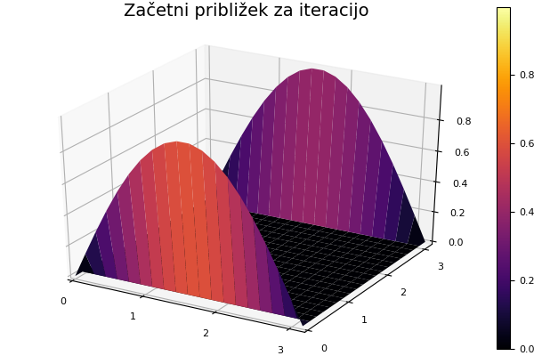

# Iteracijske metode

```@meta
CurrentModule = NumMat
DocTestSetup  = quote
    using NumMat
end
```

V [nalogi o minimalnih ploskvah](03_minimalne_ploskve.md) smo reševali linearen sistem enačb

```math
u_{i,j-1}+u_{i-1,j}-4u_{ij}+u_{i+1,j}+u_{i,j+1}=0
```

za elemente matrike $U=[u_{ij}]$, ki predstavlja višinske vrednosti na minimalni ploskvi v vozliščih kvadratne mreže. Največ težav smo imeli z zapisom matrike sistema in desnih strani. Poleg tega je matrika sistema $L$ razpršena (ima veliko ničel), ko izvedemo LU razcep ali Gaussovo eliminacijo, veliko teh ničelnih elementov postane neničelni in matrika se napolni. Pri razpršenih matrikah tako pogosto uporabimo [iterativne metode](https://en.wikipedia.org/wiki/Iterative_method#Linear_systems) za reševanje sistemov enačb, pri katerih matrika ostane razpršena in tako lahko prihranimo veliko na prostorski in časovni zahtevnosti.

!!! note "Ideja iteracijskih metod je preprosta"
    
    Enačbe preuredimo tako, da ostane na eni strani le en element s koeficientom 1. Tako dobimo iteracijsko formulo za zaporedje približkov $u_{ij}^{(k)}$. Limita rekurzivnega zaporedja je ena od fiksnih točk rekurzivne enačbo, če zaporedje konvergira. Ker smo rekurzivno enačbo izpeljali iz originalnih enačb, je njena fiksna točka ravno rešitev originalnega sistema.

V primeru enačb za laplaceovo enačbo(minimalne ploskve), tako dobimo rekurzivne enačbe

```math
u_{ij}^{(k+1)} = \frac{1}{4}\left(u_{i,j-1}^{(k)}+u_{i-1,j}^{(k)}+u_{i+1,j}^{(k)}+u_{i,j+1}^{(k)}\right),
```

ki ustrezajo [jacobijevi iteraciji](https://en.wikipedia.org/wiki/Jacobi_method)

!!! tip "Pogoji konvergence"
    
    Rekli boste, to je preveč enostavno, če enačbe le pruredimo in se potem rešitel kar sama pojavi, če le dovolj dolgo računamo. Gotovo se nekje skriva kak hakelc. Res je! Težave se pojavijo, če zaporedje približkov **ne konvergira dovolj hitro** ali pa sploh ne. Jakobijeva, Gauss-Seidlova in SOR iteracija **ne konvergirajo vedno**, zagotovo pa konvergirajo, če je matrika po vrsticah [diagonalno dominantna](https://sl.wikipedia.org/wiki/Diagonalno_dominantna_matrika).

Konvergenco jacobijeve iteracije lahko izboljšamo, če namesto vrednosti na prejšnjem približku, uporabimo nove vrednosti, ki so bile že izračunani. Če računamo element $u_{ij}$ po leksikografskem vrstnem redu, bodo elementi $u_{il}^{(k+1)}$ za $l < j$ in $u_{lj}^{(k+1)}$ za $l < i$ že na novo izračunani, ko računamo $u_{ij}^{(k+1)}$. Če jih upobimo 
v iteracijski formuli, dobimo [gauss-seidlovo iteracijo](https://en.wikipedia.org/wiki/Gauss%E2%80%93Seidel_method)

```math
u_{ij}^{(k+1)} = \frac{1}{4}\left(u_{i,j-1}^{(k+1)}+u_{i-1,j}^{(k)}+u_{i+1,j}^{(k)}+u_{i,j+1}^{(k)}\right),
```

Konvergenco še izboljšamo, če približek $u_{ij}^{(k+1)}$, ki ga dobimo z gauss-seidlovo metodo, malce zmešamo s približkom na prejšnjem koraku $u_{ij}^{(k)}$

```math
u_{ij}^{(k+1)} = (1-\omega)u_{ij}^{(k)} + \omega\frac{1}{4}\left(u_{i,j-1}^{(k+1)}+
u_{i-1,j}^{(k)}+u_{i+1,j}^{(k)}+u_{i,j+1}^{(k)}\right),
```

in dobimo [metodo SOR](https://en.wikipedia.org/wiki/Successive_over-relaxation). Parameter $\omega$ je lahko poljubno število $(0,2]$ Pri $\omega=1$ dobimo gauss-seidlovo iteracijo.


## Primer

```julia
using Plots
U0 = zeros(20, 20)
x = LinRange(0, pi, 20)
U0[1,:] = sin.(x)
U0[end,:] = sin.(x)
surface(x, x, U0, title="Začetni približek za iteracijo")
savefig("zacetni_priblizek.png")
```



```julia
L = LaplaceovOperator(2)
U = copy(U0)
animation = Animation()
for i=1:200
    U = korak_sor(L, U)
    surface(x, x, U, title="Konvergenca Gauss-Seidlove iteracije")
    frame(animation)
end
mp4(animation, "konvergenca.mp4", fps = 10)
```

```@raw html
<video width="600" height="400" controls>
<source src="../konvergenca.mp4" type="video/mp4">
<source src="konvergenca.mp4" type="video/mp4">
</video>
```

[Konvergenca Gauss-Seidlove iteracije](konvergenca.mp4)

## Konvergenca

Grafično predstavi konvergenco v odvisnoti od izbire $\omega$.

```julia
using Plots
n = 50
U = zeros(n,n)
U[:,1] = sin.(LinRange(0, pi, n))
U[:, end] = U[:, 1]
L = LaplaceovOperator(2)
omega = LinRange(0.1, 1.95, 40)
it = [iteracija(x->korak_sor(L, x, om), U; tol=1e-3)[2] for om in omega]
plot(omega, it, title = "Konvergenca SOR v odvisnosti od omega")
savefig("sor_konvergenca.svg")
```


## Metoda konjugiranih gradientov

Ker je laplaceova matrika diagonalno dominantna z $-4$ na diagonali je negativno definitna. Zato lahko uporabimo [metodo konjugiranih gradientov](https://en.wikipedia.org/wiki/Conjugate_gradient_method). Algoritem konjugiranih gradientov potrebuje le množenje z laplaceovo matriko, ne pa tudi samih elementov. Zato lahko izkoristimo možnosti, ki jih ponuja programski jezik `julia`, da lahko za [isto funkcijo napišemo različne metode za različne tipe argumentov](https://docs.julialang.org/en/v1.0/manual/methods/). 

Preprosto napišemo novo metodo za množenje [`*`](@ref), ki sprejme argumente tipa [`LaplaceovOperator{2}`](@ref LaplaceovOperator) in `Matrix`. Metoda konjugiranih gradientov še hitreje konvergira kot SOR.

```@example
using NumMat
n = 50
U = zeros(n,n)
U[:,1] = sin.(LinRange(0, pi, n))
U[:, end] = U[:, 1]
L = LaplaceovOperator{2}()
b = desne_strani(L, U)
Z, it = conjgrad(L, b, zeros(n, n))
println("Število korakov: $it")
```

## Koda

```@index
Pages = ["04_iteracijske_metode.md"]
```

```@autodocs
Modules = [NumMat, Base]
Pages = ["Laplace2Diter.jl"]
Order   = [:function, :type]
```