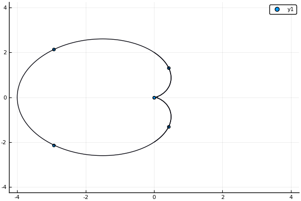

#  Interpolacija z implicitnimi funkcijami
[Radialne bazne funkcije (RBF)](https://en.wikipedia.org/wiki/Radial_basis_function) so funkcije, katere vrednosti so odvisne od razdalje do izhodiščne točke
$$f(\vec{x}) = \varphi(\|\vec{x}-\vec{x}_0\|)$$
Uporabljajo se za interpolacijo ali aproksimacijo s funkcijo oblike
$$\sum_i w_i\varphi(\|\vec{x}-\vec{x}_i\|),$$ 
npr. za rekonstrukcijo 2D in 3D oblik v računalniški grafiki. Funkcija $\varphi$ je navadno pozitivna soda funkcija zvončaste oblike in jo imenujemo funkcija oblike.

Podan je 2D ali 3D oblak točk $\{\vec{x}_1, \ldots \vec{x}_n\}$ in realne vrednosti $\{f_1, \ldots, f_n\}$. Napiši funkcijo, ki interpolira omenjene podatke s funkcijo oblike

$$F(\vec{x}) = \sum_i w_i\varphi(\|\vec{x}-\vec{x}_i\|).$$

To pomeni, da poiščeš vrednosti uteži $w_i$ tako, da bodo izpolnjene enačbe
$$F(\vec{x_i}) = f_i.$$

## Naloga

Napiši dve funkciji:
 - `w = koeficienti_rbf(phi, x0, f)`, ki poišče vrednosti uteži, če so podane funkcija oblike `phi`, oblak točk podan z matriko `x0` in tabela vrednosti `f`.
 - `z = vrednost_rbf(x, w, x0)`, ki izračuna vrednost 
 $$F(\vec{x})\sum_i w_i\varphi(\|\vec{x}-\vec{x}_i\|)$$ za argument `x`, pri čemer je `w` vektor uteži $w_i$, `x0` pa oblak točk, podan kot matrika.

Funkciji uporabi za interpolacijo točk v ravnini z implicitno podano krivuljo, kot v naslednjem primeru:

```julia
using Plots
fi = range(0, 2π, length=6)
tocke = [2(1-cos(t)).*(cos(t), sin(t)) for t in fi]
scatter(tocke)
f(x,y) = (x^2 + y^2)^2 + 4x*(x^2 + y^2) - 4y^2
x = y = range(-4, 4, length = 100)
contour!(x, y, f, levels = [0])
```



Točke ležijo na nivojnici funkcije $f(x,y) = (x^2 + y^2)^2 + 4x(x^2 + y^2) - 4y^2$ za nivo $f(x, y)=0$.

### Danes bomo spoznali

1.  kako napisatni sistem enačb za praktičen primer
2.  primerno izbiro metode za reševanje
3.  implementacija v programskem jeziku in težave

## Opis krivulj z implicitno interpolacijo

Iz množice točk želimo rekonstruirati krivuljo, ki gre skozi te točke.
Krivulje v ravnini lahko opišemo na različne načine

1.  **eksplicitno**: $y=f(x)$
2.  **parametrično**: $(x,y) = (x(t),y(t))$
3.  **implicitno** z enačbo $F(x,y)=0$

Tokrat se bomo posvetili implicitni predstavitvi krivulje.

## Problem

Imamo točke v ravnini s koordinatami
$(x_1,y_1),(x_2,y_2),\ldots, (x_n,y_n)$. Iščemo krivuljo, ki gre skozi
vse točke. Po možnosti naj bo krivulja gladka, poleg tega ni nujno, da
do zaporedne točke v seznamu, tudi zaporedne točke na krivulji. Krivuljo
iščemo v **implicitni** obliki, torej v obliki enačbe

```math
F(x,y) = 0.
```

Iskano krivuljo bomo zapisali kot ničto nivojnico neke funkcije
$F(x,y)$. Iščemo torej funkcijo $F(x,y)$, za katero velja

```math
F(x_i,y_i) = 0\quad i\le n.
```


Ta pogoj žal ne zadošča. Dodamo moramo še nekaj točk, ki so znotraj
območja omejenega s krivuljo. Označimo jih z
$(x_{n+1},y_{n+1}),\ldots,(x_m,y_m)$, v katerih predpišemo vrednost $1$

```math
F(x_i,y_i) = 1\quad i\ge n+1.
```

## Naloga

Napiši program, ki za dane točke poišče interpolacijsko funkcijo oblike
```math
F(\mathbf{x})=\sum_i d_i\phi(\mathbf{x}-\mathbf{x}_i)+P(\mathbf{x}),
```

kjer so

-   $\mathbf{x} = (x,y)$
-   $P(\mathbf{x})$ polinom stopnje 1 (linearna funkcija v $x$ in $y$)
-   $d_i$ primerno izbrane uteži.
-   $\phi$ radialna bazna funkcija, ki je odvisna zgolj od razdalje do *i*-te
    točke $r = \|\mathbf{x}-\mathbf{x}_i\|$.
    * "thin plate": $\phi(r)=|r|^2\log(|r|)$ za 2D in $\phi(r)=|r|^3$ za 3D
    * Gaussova: $\phi(r)=\exp(-r^2/\sigma^2)$ 
    * racionalni približek za Gaussovo

```math
\phi(r)=\frac{1}{1+r^{2p}}
```
### Časovna in prostorska zahtevnost

* zgraditev matrike: $\mathcal{O}(n^2)$
* rešitev sistema: $\mathcal{O}((n^2))$, če uporabimo iteracijske metode
* računanje vrednosti funkcije: $\mathcal{O}(n)$

## RBF s kompaktnim nosilcem
Matrika sistema, če uporabimo klasične RBF iz prejšnjega razdelka je polna. Čeprav je večina členov izven diagonale zelo majhnih npr. pri gaussovi RBF. Zato so [Morse et. all]@ref(Povezave) prišli na idejo, da uporabijo RBF s kompaktnim nosilcem. V tem primeru je matrika precej bolj redka in se tako prostorska kot tudi časovna zahtevnost algoritmov bistveno zmanjšata.
## Povezave

- Savchenko V. V., Pasko, A. A., Okunev, O. G. and Kunii T. L. *Function representation of solids reconstructed from scattered surface points and contours*, Computer Graphics Forum 14(4) (1995),[pdf](http://citeseerx.ist.psu.edu/viewdoc/download?doi=10.1.1.48.80&rep=rep1&type=pdf)
- G. Turk and J. O'Brien, *Variational Implicit Surfaces*, Technical Report GIT-GVU-99-15, Georgia Institute of Tech-nology, 1998.[pdf](https://pdfs.semanticscholar.org/a44c/d6b3c709e69f8194fcc2513394ddc410d9be.pdf)
- Morse, B. S., Yoo, T. S., Rheingans, P., et al. Interpolating implicit surfaces from scattered surface data using compactly supported radial basis functions, SMI 2001 International Conference on Shape Modeling and Applications, Genova Italy, (2001) [pdf](https://www.cs.jhu.edu/~misha/Fall13b/Papers/Morse01.pdf)