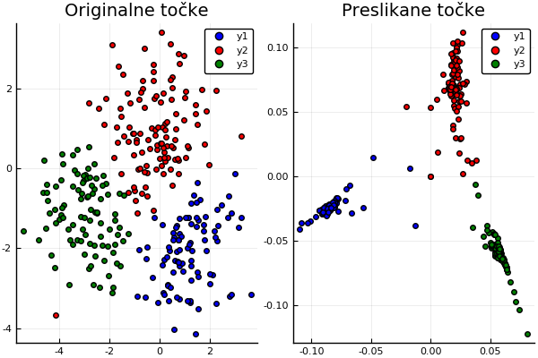

# Spektralno razvrščanje v gruče

```@meta
CurrentModule = NumMat
DocTestSetup  = quote
    using NumMat
end
```

Pokazali bomo metodo razvrščanja v gruče, ki uporabi spektralno analizo
Laplaceove matrike podobnostnega grafa podatkov, zato da podatke preslika v
prostor, kjer jih je lažje razvrstiti.

## Podobnostni graf in Laplaceova matrika

Podatke (množico točk v $\mathbb{R}^n$) želimo razvrstiti v več gruč. Najprej
ustvarimo *podobnostni uteženi graf*, ki povezuje točke, ki so si v nekem smislu
blizu. Podobnostni graf lahko ustvarimo na več načinov:

* **ε-okolice**: s točko *xᵢ* povežemo vse točke, ki ležijo v ε-okolici te točke
* **k-najbližji sosedi**: *xₖ* povežemo z *xᵢ*, če je *xₖ* med *k* najbližjimi
točkami. Tako dobimo usmerjen graf, zato ponavadi upoštevmo povezavo v obe
smeri.
* **poln utežen graf**: povežemo vse točke, vendar povezave utežimo glede na
  razdaljo. Pogosto uporabljena utež je nam znana [radialna bazna funkcija](https://en.wikipedia.org/wiki/Radial_basis_function)

```math
w(x_i, x_k) = \exp\left(-\frac{\|x_i-x_k\|^2}{2\sigma^2}\right)
```

pri kateri s parametrom $\sigma$ lahko določamo velikost okolic.

Grafu podobnosti priredimo matriko uteži

```math
W =[w_{ij}],
```

in Laplaceovo matriko

```math
L = D - W,
```

kjer je $D=[d_{ij}]$ diagonalna matrika z elemetni $d_{ii}=\sum_{j}w_{ij}$.
Laplaceova matrika $L$ je simetrična, nenegativno definitna in ima vedno eno lastno
vrednost 0 za lastni vektor iz samih enic.

## Algoritem

Velja naslednji izrek, da ima Laplaceova matrika natanko toliko lastnih
vektorjev za lastno vrednost 0, kot ima graf komponent za povezanost. Na prvi
pogled se zdi, da bi lahko bile komponente kar naše gruče, a se izkaže, da to ni
najbolje.

* Poiščemo *k* najmanjših lastnih vrednosti za Laplaceovo matriko in
  izračunamonjihove lastne vektorje.
* Označimo matriko lastnih vektorjev *Q=[v₁, v₂, ...,vₖ]*. Stolpci *Qᵀ*
  ustrezajo koordinatam točk v novem prostoru.
* Za stolpce matrike *Qᵀ* izvedemo nek drug algoritem gručenja (npr. algoritem
   *k* povprečij).

!!! note "Algoritem k-povprečij"

    Izberemo si število gruč $k$. Najprej točke naključno razdelimo v $k$ gruč. 
    Nato naslednji postopek ponavljamo, dokler ne konvergira
    * izračunamo center posamezne gruče $c_i=\frac{1}{|G_i|}\sum_{j\in G_i}\mathbf{x}_i$
    * vsako točko razvrstimo v gručo, ki ima najbližji center

## Primer

Algoritem preverimo na mešanici treh gaussovih porazdelitev

```julia
using Plots
using Random
m = 100;
Random.seed!(12)
x = [1 .+ randn(m, 1); -3 .+ randn(m,1); randn(m,1)];
y = [-2 .+ randn(m, 1); -1 .+ randn(m,1); 1 .+ randn(m,1)];
scatter(x, y, title="Oblak točk v ravnini")
savefig("06_oblak.png")
```


Izračunamo graf sosednosti z metodo $\varepsilon$-okolic in poiščemo laplaceovo
matriko dobljenega grafa.

```julia
using SparseArrays
tocke = [(x[i], y[i]) for i=1:3*m]
r = 0.9
G = graf_eps_okolice(tocke, r)
L = LaplaceovaMatrika(G)
spy(sparse(Matrix(L)), title="Porazdelitev neničelnih elementov v laplaceovi matriki")
savefig("06_laplaceova_matrika_grafa.png")
```


Če izračunamo lastne vektorje in vrednosti laplaceove matrike dobljenega
grafa, dobimo 4 najmanjše lastne vrednosti, ki očitno odstopajo od ostalih.

```julia
import LinearAlgebra.eigen
razcep = eigen(Matrix(L))
scatter(razcep.values[1:20], title="Prvih 20 lastnih vrednosti laplaceove matrike")
savefig("06_lastne_vrednosti.png")
```


```julia
scatter(razcep.vectors[:,4], razcep.vectors[:,5], title="Vložitev s komponentami 4. in 5. lastnega vektorja")
savefig("06_vlozitev.png")
```


## Inverzna potenčna metoda

Ker nas zanima le najmanjših nekaj lastnih vrednosti, lahko njihov izračun in za
izračun lastnih vektrojev uporabimo [inverzno potenčno
metodo](https://en.wikipedia.org/wiki/Inverse_iteration). Pri inverzni potenčni
metodi zgradimo zaporedje približkov z rekurzivno formulo

```math
\mathbf{x}^{(k+1)} = \frac{A^{-1}\mathbf{x}^{(n)}}{\|A^{-1}\mathbf{x}^{(n)}\|}
```

in zaporedje približkov konvergira k lastnemu vektorju za najmanjšo lastno vrednost matrike $A$.

!!! warning "Namesto inverza uporabite razcep"

     Računanje inverza je časovno zelo zahtevna operacija, zato se jo razen v nizkih dimenzijah,
     če je le mogoče izognemo. Namesto inverza raje uporabimo enega od razcepov matrike $A$.
     Če naprimer uporabimo LU razcep $A=LU$, lahko $A^{-1}\mathbf{b}$ izračunamo tako, da rešimo 
     sistem $A\mathbf{x} = \mathbf{b}$ oziroma $LU\mathbf{x} = \mathbf{b}$ v dveh korakih

     $$
     \begin{aligned}
     L\mathbf{y}&=\mathbf{b}\cr
     U\mathbf{x}&=\mathbf{y}
     \end{aligned}
     $$

     Programski jezik `julia` ima za ta namen prav posebno metodo [factorize](https://docs.julialang.org/en/v1/stdlib/LinearAlgebra/index.html#LinearAlgebra.factorize), ki za različne matrike, izračuna najbolj primeren razcep.

Laplaceova matrika je simetrična, zato so lastne vrednosti ortogonalne. Lastne vektorje lahko tako
poiščemo tako, da iteracijo izvajamo na več vektorjih hkrati in nato na dobljeni
bazi izvedemo ortogonalizacijo (QR razcep), da zaporedje lastnih vektorjev za
lastne vrednosti, ki so najbližje najmanjši lastni vrednosti.

Laplaceova matrika grafa okolic je simetrična in diagonalno dominantna. Poleg
tega je zelo veliko elementov enakih 0. Zato za rešitev sistema uporabimo metodo
[konjugiranih
gradientov](https://en.wikipedia.org/wiki/Conjugate_gradient_method). Za uporabo
metode konjugiranih gradientov zadošča, da učinkovito izračunamo množenje
matrike z vektorjem. Težava je, ker so je laplaceova matrika grafa izrojena, zato metoda konjugiranih gradientov ne konvergira. Težavo lahko rešimo s premikom. Namesto, da računamo lastne vreednosti in vektorje matrike $L$, iščemo lastne vrednosti in vektorje malce premaknjene matrike $L+\varepsilon I$, ki ima enake lastne vektorje, kot $L$.

!!! note

    Programski jezik julia omogoča polimorfizem v obliki [večlične
    dodelitve](https://docs.julialang.org/en/v1/manual/methods/index.html). Tako
    lahko za isto funkcijo definiramo različne metode. Za razliko od polmorfizma
    v objektno orientiranih jezikih, se metoda izbere ne le na podlagi tipa
    objekta, ki to metodo kliče, ampak na podlagi tipov vseh vhodnih argumentov.
    To lastnost lahko s pridom uporabimo, da lahko pišemo generično kodo, ki
    deluje za veliko različnih vhodnih argumentov. Primer je funkcija
    [`conjgrad`](@ref), ki jo lahko uporabimo tako za polne matrike, matrike tipa
    `SparseArray` ali pa tipa `LaplaceovaMatrika` za katerega smo posebej
    definirali operator množenja [`*`](@ref).

```math
L\mathbf{x^{(k+1)}} = \mathbf{x^{(k)}}
```

Primerjajmo inverzno potenčno metodo z vgrajeno metodo za iskanje lastnih vrednosti s polno matriko

```julia
import Base:*, size
struct PremikMatrike
   premik
   matrika
end
*(p::PremikMatrike, x) = p.matrika*x + p.premik.*x
size(p::PremikMatrike) = size(p.matrika)

Lp = PremikMatrike(0.01, L)
l, v = inverzna_iteracija(Lp, 5, (Lp, x) -> conjgrad(Lp, x)[1])
```

## Algoritem k-povprečij

```julia
nove_tocke =  [tocka for tocka in zip(razcep.vectors[:,4], razcep.vectors[:,5])]
gruce = kmeans(nove_tocke, 3)

p1 = scatter(tocke[findall(gruce .== 1)], color=:blue, title="Originalne točke")
scatter!(p1, tocke[findall(gruce .== 2)], color=:red)
scatter!(p1, tocke[findall(gruce .== 3)], color=:green)

p2 = scatter(nove_tocke[findall(gruce .== 1)], color=:blue, title="Preslikane točke")
scatter!(p2, nove_tocke[findall(gruce .== 2)], color=:red)
scatter!(p2, nove_tocke[findall(gruce .== 3)], color=:green)

plot(p1,p2)
savefig("06_gruce.png")
```



## Literatura

* Ulrike von Luxburg [A Tutorial on Spectral
   Clustering](https://arxiv.org/abs/0711.0189)
* Peter Arbenz [Lecture Notes on Solving Large Scale Eigenvalue Problems](http://people.inf.ethz.ch/arbenz/ewp/Lnotes/lsevp.pdf)
* Knjižnica [Laplacians.jl](http://danspielman.github.io/Laplacians.jl/latest/index.html)

## Koda

```@index
Pages = ["06_spektralno_grucenje.md"]
```

```@autodocs
Modules = [NumMat, Base]
Pages = ["spektralno_grucenje.jl", "kmeans.jl", "kddrevo.jl"]
Order   = [:function, :type]
```