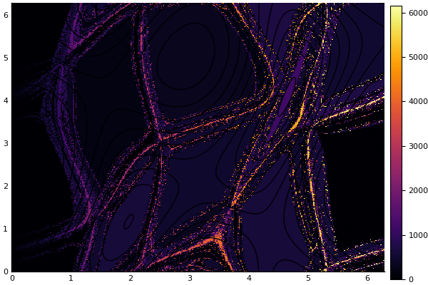

# Nelinearne enačbe in geometrija

```@meta
CurrentModule = NumMat
DocTestSetup  = quote
    using NumMat
end
```

Ogledali si bomo nekaj primerov uporabe metod za reševanje *nelinearnih enačb* v geometriji krivulj in ploskev v 2D in 3D.

## Samopresečišče krivulje

Poišči samopresečišča različnih [lissajousjevih krivulj](https://sl.wikipedia.org/wiki/Lissajousova_krivulja). Lissajousjeva krivulja je podana parametrično z enačbama

```math
(x(t), y(t)) = (a\sin(n t), b\cos(m t)).
```

Primer lissajoujeve krivulje za $n=3, m=2$

```@example lissajous
using Plots
x(t) = cos(3*t); y(t) = sin(2*t);
t = range(0, stop=2pi, length=100)
plot(x.(t), y.(t), grid=false, legend=:none)
t = range(0, stop=6, length=21)
# scatter!(x.(t), y.(t))
# annotate!([(x(tt)+0.05, y(tt)+0.05, "t=$tt") for tt in t])
```

Samopresečišče lahko poiščemo z Newtonovo metodo

```@example lissajous
dx(t) = -3sin(3t); dy(t) = 2cos(t);
f(t, s) = [x(t) - x(s), y(t) - y(s)]
Jf(t, s) = [dx(t) -dx(s); dy(t) -dy(s)]

let t0 = 1; s0 = 3
plot!([x(t0), x(s0)], [y(t0), y(s0)], marker=:circle)
for i=1:5
  t0, s0 = [t0, s0] - Jf(t0, s0)\f(t0, s0)
  plot!([x(t0), x(s0)], [y(t0), y(s0)], marker=:circle)
end
end # let
plot!(legend=false)
```

## Območje konvergence

Konvergenca newtonove metode je odvina od začetnega približka. 
## Razdalja med dvema krivuljama

Naj bosta $K_1$ in $K_2$ parametrično podani krivulji

```math
\begin{aligned}
K_1 &: (x(t),y(t)),\quad t\in\mathbb{R}\cr
K_2& : (\tilde{x}(s),\tilde{y}(s)),\quad s\in\mathbb{R}.
\end{aligned}
```

Razdaljo med krivuljama lahko definiramo na različne načine

* najmanjša razdalja $d(K_1, K_2) = \min_{x\in K_1, y\in K_2} d(x,y)$
* [hausdorffova razdalja](https://en.wikipedia.org/wiki/Hausdorff_distance)

```math
  d_h(K1, K2) = \max\left\{\max_{x\in K_2}\min_{y\in K_1}d(x,y), 
                          \max_{x\in K_1}\min_{y\in K_2}d(x,y)
                          \right\}
```

!!! note "Hausdorffova razdalja"

    Hausdorffova razdalja pove, koliko je lahko točka na eni krivulji največ 
    oddaljena od druge krivulje. Če sta množici blizu v hausdorffovi razdalji, 
    je vsaka točka ene množice blizu drugi množici. Medtem, ko je minimalna 
    razdalja med dvema krivuljama vedno končna, pa je lahko hausdorffova 
    razdalja tudi neskončna (na primer, če je ena krivulja omejena, druga 
    pa neomejena).

Najlažje je poiskati minimalno razdaljo. Iščemo točki na krivuljah
$(x(t_0),y(t_0))\in K_1$ in $(\tilde{y}(s_0),\tilde{y}(s_0))\in K_2$, za katere
bo razdalja

```math
d(t,s)=\sqrt{(x(t)-\tilde{x}(s))^2+(y(t)-\tilde{y}(s))^2}
```

najmanjša. Ker je koren naraščajoča funkcija, ga lahko pri iskanju minimuma brez
škode izpustimo in obravnavamo funkcijo

```math
D(t,s)=d(t,s)^2=(x(t)-\tilde{x}(s))^2+(y(t)-\tilde{y}(s))^2,
```

ki je bolj enostavna za računanje. Opazimo, da je razdalja odvisna le od
parametrov $t$ in $s$. Dovolj je, da poiščemo vrednosti $(t_0, s_0)$, v katerih
bo vrednost funkcije $d(t, s)$ oziroma $D(t, s)$ minimalna. Če je območje
parametrov $(t, s)\in\mathbb{R}^2$ cela ravnina, bo najmanjša vrednost nastopila
v *lokalnem ekstremu*, v katerem je tudi *stacionarna točka* funkcije $D(t, s)$.
Iskanja lokalnega ekstrema se bomo lotili na dva različna načina, a še prej si
oglejmo primer.

### Primer

Poglejmo si primer dveh elips v ravnini

```math
\begin{aligned}
 x(t) &= 2\cos(t)+\frac{1}{3}\cr
 y(t) &= \sin(t)+\frac{1}{4}\end{aligned}
```

in

```math
\begin{aligned}
 \tilde{x}(s) &= \frac{1}{3}\cos(s)-\frac{1}{2}\sin(s)\cr
 \tilde{y}(s) &= \frac{1}{3}\cos(s)+\frac{1}{2}\sin(s)\end{aligned}
```

Narišimo ju z

```@example krivulji
using Plots
tocka(a) = tuple(a...)
K1(t) = [2*cos(t) + 1/3, sin(t) + 0.25]
K2(s) = [cos(s)/3 - sin(s)/2, cos(s)/3 + sin(s)/2]
t = LinRange(0, 2*pi, 60);
plot(tocka.(K1.(t)), label="K1")
plot!(tocka.(K2.(t)), label="K2")
```

Narišimo tudi graf funkcije $D(t,s)$ na pravokotniku
$[0,2\pi]\times[0,2\pi].$

```@example krivulji
D(t, s) = sum((K1(t) - K2(s)).^2)
contourf(t, t, D, title="Kvadrat razdalje, v odvisnosti od parametrov")
```

### Metoda najhitrejšega spusta

Metoda je sila enostavna. Najlažje si jo predstavljamo za iskanje lokalnega
mimimuma nadmorske višine. Sestopili bi radi na dno kraške vrtače. Če se držimo
metode najhitrejšega spusta, na vsakem koraku izberemo smer, v kateri je pobočje
najbolj strmo. V jeziku funkcij to pomeni, da na vsakem koraku izberemo smer, v
kateri funkcija najhitreje pada. To je ravno v nasprotni smeri gradienta
funkcije. Lokalnemu minimumu funkcije $f(\mathbf{x})$ se lahko tako približamo z
naslednjim zaporedjem približkov

```math
\mathbf{x}_n=\mathbf{x}_{n-1}-h_n\bigtriangledown f(\mathbf{x}),
```

kjer je $\mathbf{x}=[x_1,\ldots,x_k]^T$ vektor spremenljivk, $h_n\in \mathbb{R}_+$ pa omejeno zaporedje, ki je lahko tudi konstantno. 

```@example krivulji
using NumMat
dK1(t) = [-2sin(t), cos(t)]
dK2(s) = [-sin(s)/3 - cos(s)/2, -sin(s)/3 + cos(s)/2]
gradD = gradient_razdalje(K1, K2, dK1, dK2)
slika = contour(t, t, D, title="Zaporedje korakov gradientne metode")

let
x0 = [0.4, 3.3]
h = 0.2
priblizki = [tuple(x0...)]
for i=1:40
  x0 = x0 - h*gradD(x0)
  push!(priblizki, tuple(x0...))
end
scatter!(slika, priblizki)
end # let
slika #hide
```

!!! warning "Konvergenca je odvisna od zažetnega približka"

    Limita zaporedja $\mathbf{x}_n$ je zelo odvisna od začetnega približka
    $x_0$, pa tudi od izbire parametra $h_k$. Kaj lahko se nam zgodi, da 
    bomo pristali v "napačnem" minimumu. Prav tako je konvergenca vedno 
    počasnejša, bližje kot smo minimu.

### Newtonova metoda

Fermat je med drugim dokazal izrek, ki pove, da je v lokalnem ekstremu
vrednost odvoda vedno enaka 0. Isti izrek velja tudi za funkcije več
spremenljivk, le da je v tem primeru gradient funkcije enak 0. 

Ta izrek morda ni tako razvpit kot njegov zadnji izrek, je pa zato toliko bolj
uporaben. Potreben pogoj za nastop lokalnega ekstrema je namreč vektorska enačba

```math
\bigtriangledown D(s,t)=0,
```

ki je v našem primeru sistem dveh enačb z dvema
neznankama

```math
\begin{aligned} \frac{\partial D(t,s)}{\partial t} =
2(x(t)-\tilde{x}(s))\dot{x}(t) + 2(y(t)-\tilde{y}(s))\dot{y}(t) &=
0\cr
\frac{\partial D(t,s)}{\partial s} =
-2(x(t)-\tilde{x}(s))\dot{\tilde{x}}(s) - 2(y(t)-\tilde{y}(s))\dot{\tilde{y}}(s)
&= 0.\end{aligned}
```

Rešitev zgornjega sistema lahko poiščemo numerično z uporabo Newtonove metode za
sisteme enačb. Podobno kot pri Newtonovi metodi za eno spremenljivko potrebujemo
odvod, vendar imamo pri več enačbah z več spremenljivkami opravka z odvodom
vektorske funkcije več spremenljivk. Sistem lahko
zapišemo kot eno samo vektorsko enačbo 

```math
\mathbf{F}(t,s)=0,
```

kjer pa je

```math
\mathbf{F}(t,s)=\begin{pmatrix} F_1(t,s)\cr F_2(t,s) \end{pmatrix}
= \begin{pmatrix} \frac{\partial D(t,s)}{\partial t}\cr \frac{\partial
D(t,s)}{\partial s} \end{pmatrix}
```

vektorska funkcija. Odvod funkcije $\mathbf{F}$ lahko predstavimo z linearno
preslikavo, ki je dana z matriko (imenovano tudi [Jacobijeva
matrika](https://sl.wikipedia.org/wiki/Jacobijeva_matrika) sistema):

```math
J(\mathbf{F}(t,s))=\begin{pmatrix} \frac{\partial F_1(t,s)}{\partial t} &
\frac{\partial F_1(t,s)}{\partial s}\cr \frac{\partial F_2(t,s)}{\partial t} &
\frac{\partial F_2(t,s)}{\partial s} \end{pmatrix}
```

Pri Newtonovi metodi sestavimo zaporedje približkov definirano z naslednjo
rekurzivno formulo

```math
\mathbf{x}_n = \mathbf{x}_{n-1} -
J(\mathbf{F}(\mathbf{x}_{n-1}))^{-1}\cdot\mathbf{F}(\mathbf{x}_{n-1}), \quad
\mathbf{x}_n = (t_n,s_n)^T.
```

Če je zaporedje $\mathbf{x}_n$ konvergentno, potem je limita rešitev enačbe
$\mathbf{F}(\mathbf{x})=0$. Zaporedje $\mathbf{x}_n$ ponavadi zelo hitro
konvergira, zato za rešitev potrebujemo relativno malo korakov. Prav tako
Newtonovo iteracijo hitro sprogramiramo, saj je dovolj že ena zanka.

Vrnimo se k našem primeru razdalje med dvema krivuljama. Jacobijeva matrika je v
tem primeru kar matrika drugih odvodov funkcije razdalje $D(t,s)$

```math
J(\mathbf{F}(t,s)) = \begin{pmatrix} \frac{\partial^2 D(t,s)}{\partial t^2} &
\frac{\partial^2 D(t,s)}{\partial s\partial t}\cr \frac{\partial^2
D(t,s)}{\partial t\partial s} & \frac{\partial^2 D(t,s)}{\partial s^2}
\end{pmatrix}.
```

 Enačbe za druge odvode $D(s,t)$ hitro izpeljemo iz gradienta $D(t,s)$

```math
\begin{aligned}
\frac{\partial^2 D(t,s)}{\partial
t^2}&=2(\ddot{x}(t)(x(t)-\tilde{x}(s)) +\dot{x}^2(t) +
\ddot{y}(t)(y(t)-\tilde{y}(s)) +\dot{y}^2(t))\cr
\frac{\partial^2
D(t,s)}{\partial s^2} &= 2(-\ddot{\tilde{x}}(s)(x(t)-\tilde{x}(s))
+\dot{\tilde{x}}^2(s) - \ddot{\tilde{y}}(s)(y(t)-\tilde{y}(s))
+\dot{\tilde{y}}^2(s))\cr
\frac{\partial^2 D(t,s)}{\partial t\partial s} &=-2(\dot{\tilde{x}}(s)\dot{x}(t)+
\dot{\tilde{y}}(s)\dot{y}(t).
\end{aligned}
```

 Poleg tega velja

```math
\frac{\partial^2
D(t,s)}{\partial s\partial t}= \frac{\partial^2 D(t,s)}{\partial t\partial s}.
```

Preskusimo sedaj Newtonovo metodo za naš primer dveh elips. Funkcija, katere
ničle iščemo je kar enaka gradientu. Napisati moramo še funkcijo, ki vrne
Jacobijevo matriko. 

!!! note "Avtomatsko odvajanje"

    Iskanje odvodov postane hitro zamudno in mimogrede se pri računanju
    človek zmoti. Na srečo si lahko pri tem si lahko pomagamo z [avtomatskim
    odvajanjem](https://en.wikipedia.org/wiki/Automatic_differentiation), ki
    programsko iz programa za funkcijo generira program za odvod. Julija
    ima več knjižnic za ta namen, mi bomo uporabili
    [ForwardDiff.jl](https://github.com/JuliaDiff/ForwardDiff.jl).

```@example krivulji
using ForwardDiff
D2((t,s)) = sum((K1(t)-K2(s)).^2)
gradD2(x) = ForwardDiff.gradient(D2, x)
hessD2(x) = ForwardDiff.hessian(D2, x)

slika = contour(t, t, (t, s)-> D2((t,s)), title="Zaporedje korakov Newtonove metode")

x0 = [1., 4.]
priblizki = [tuple(x0...)]

let
x = x0
for i=1:10
  x = x - hessD2(x)\gradD2(x)
  push!(priblizki, tuple(x...))
end
end # let
scatter!(slika, priblizki)
```

```@example krivulji
plot(tocka.(K1.(t)), label="K1", aspect_ratio=:equal, title="Sedlo")
plot!(tocka.(K2.(t)), label="K2")
t0, s0 = priblizki[end]
plot!(tocka.([K1(t0), K2(s0)]), marker=:circle, label="zadnji korak")
```

### Konvergenčno območje

Konvergenca tako gradientne kot tudi newtonove metode je zelo odvisna od začetnega približka. 

```julia-repl
julia> using Plots;
julia> x, y, Z = konvergencno_obmocje((0, 2pi, 0, 2p), 
  x -> newton(gradD2, hessD2, x; maxit=20, tol=1e-3), n=300, m=300);
julia> heatmap(x, y, Z')
julia> contour!(x, y, (x,y)->razdalja((x,y)))
julia> maximum(Z)
6157.0

```



Konvergenčno območje newtonove metode je razdeljeno. Iz slike je razvidno, da je veliko različnih približkov (6157), h kateri konvergira newtonova metoda na območju $[0,2\pi]\times[0, 2\pi]$, čeprav je na tem območju le nekaj rešitev.

```julia-repl
julia> using Plots;
julia> x, y, Z = konvergencno_obmocje((0, 2pi, 0, 2pi),
       x -> spust(grad, x; maxit=1000, tol=1e-3), tol=1e-1, n=200, m=200)
julia> heatmap(x, y, Z')
julia> contour!(x, y, (x,y)->razdalja((x,y)))
julia> maximum(Z)
8.0
```


Za razliko od newtonove metode, je konvergenčno območje gradientne metode precej bolj predvidljivo.

## Drugi primeri nelinearnih enačb iz 3D geometrije

* presečišče dveh krivulj v 2D
* presečišče krivulje in ploskve v 3D
* presečišče dveh ploskev v 3D

## Koda

```@index
Pages = ["01_razdalja.md"]
```

```@autodocs
Modules = [NumMat]
Pages = ["razdalja.jl"]
Order   = [:function, :type]
```
